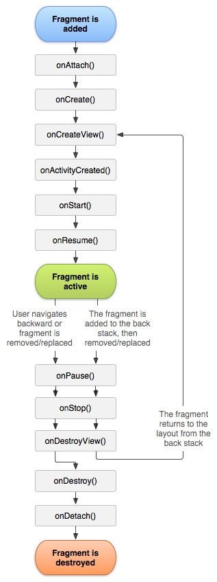

# 生命周期相关流程

```
MainActivity、PageActivity、DialogActivity、FristFragment、SecondFragment
用来验证 Activity 与 Fragment 的生命周期过程。
包含页跳转、前后台切换等
Dialog生命周期

launchMode 启动模式

View Measure 过程
MeasureSpec 作用与数据流向


```

## Activity 生命周期函数
 
```
[1]onCreate（不可见）
[2]onNewIntent 复用 Activity 时 onNewIntent onRestart onStart onResume,只是不执行 onCreate
[4]onRestart(回前端)
[5]onStart（可见）
[6]onResume（可见）
运行中
[7]onPause(可见)
[8]onStop（不可见）
[9]onDestory（销毁）

[10]onAttachFragment [Activity 中挂载了 Frament 时]
[11]onSaveInstanceState [内存吃紧或被后台系统销毁时]
[12]onRestoreInstanceState [与11不一定成对出现]
```
### Activity 生命周期

<br>
### Fragment 生命周期


## Fragment生命周期函数
```
[1]onAttach
[2]onCreate
[3]onCreateView
[4]onViewCreated
[5]onStart
[6]onResume
[7]onPause
[8]onStop
[9]onDestory
[10]onDetach
```

## Activity 生命周期场景
```
启动 -> 退出： A[1 5 6] - 运行中 - A[7  8 9]
1. A中弹系统级 Dialog或弹出可见 DialogActivity: [7]执行
2. A 中弹出自身 Dialog:  [无我生命周期执行]
3. A -> B : A7 - B[1 5 6] - A8
4. 再 B->A: B7 - A4(onRestart) - A5 - A6 - B8 - B9
```

## Fragment 生命周期场景
```
A:普通 Activity，B: 普通 Activity 含有 Fragment (BF_a 、 BF_b)
A -> B: A7 - B1 - B[10 onAttachFragment] - BF[1 - 4] - {BF5} - B5 - B6 - BF6 - A8
BF 前台切后台：BF7 - B7 - BF8 - B8
BF 后台切前台：B4(内存吃紧会调onRestart) - BF5（onStart） - B5（onStart） - B6（onResume） - BF6（onResume） 
再 B -> A: BF7 - B7 - A[4 - 6] - BF8 - B8 - BF9 - B9
```
### Activity内，两 Fragment 间切换的生命周期
```
BF_a -> BF_b : BF_b[1-6] - BF_a[7 8]
再 BF_b -> BF_a : BF_a[3-6] - BF_b[7-10]
```

## DialogActivity
```
A 普通 Activity； DA：DialogActivity
打开 DA，与关闭 DA 的生命周期流程

A -> showDialogActivity[DA]: A7 - DA[1 5 6]
退后台：DA7 - A7 - DA8 [无 A8]
回前台：A[4 5 ] - DA[4 - 6] [无 A6]
DA -> A: DA7 - A6 - DA[8 9]
```

## Dialog
```
activity 中 showDialog 是不会触发Activity 的任何生命周期的

退后台Activity 走：[7 8]
加前台Activity 走：[4 5 6]
```

```Dialog
show: [ constructor 2 、onContentChanged 、 onCreate 、 onStart 、 show 、 onAttachedToWindow ]
dismiss: [onKeyDown: 4 、 onKeyUp: 4 、 onDetachedFromWindow 、 onStop 、 dismiss 、 cancel 、 onBackPressed]
outsideCancel: [onDetachedFromWindow 、 onStop 、 dismiss 、 cancel]

退后台：[无生命周期函数被调用]??
回前台：[无生命周期函数被调用]??
```

## Activity 启动模式launchMode
```
standard 新建至栈顶
singleTop 栈顶复用
singleTask 栈内复用，上方其它全弹出
singleInstance 单例
```

## 当A为singleTask或者singleInstance时,类重启 Activity

A -> B -> A: 返回A的生命周期 [2 4 5 6 onNewIntent onRestart onStart onResume]

## 当A为singleTop、singleTask或者singleInstance时，类复用

A -> A: 返回A的生命周期 [7 5 6 onPause onNewIntent onResume]

## 旋转屏幕


## RecyclerView

## View 事件分发、拦截、处理

## View 绘制

onMeasure 过程

onLayout 过程

onDraw 过程


## ViewModel

